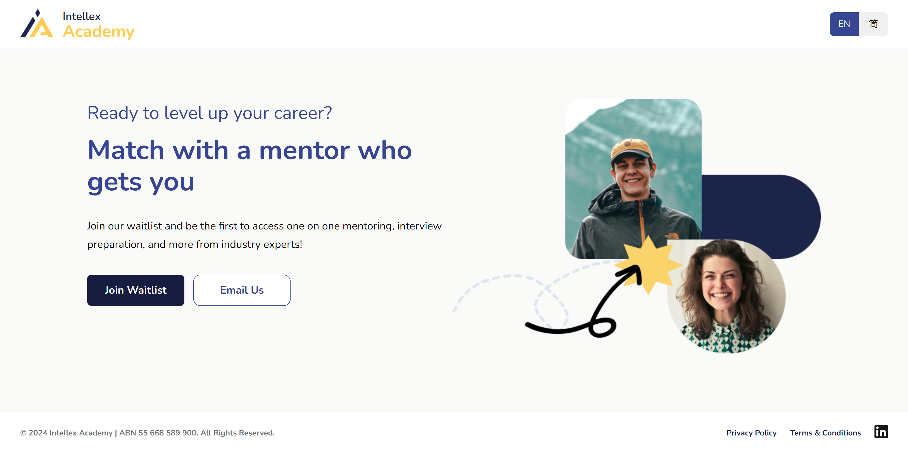

<!-- PROJECT SHIELDS -->

[![Issues][issues-shield]][issues-url]
[![LinkedIn][linkedin-shield]][linkedin-url]

<!-- PROJECT LOGO -->
 

  

<h3 align="center">Intellex Academy: Pre-registration</h3>

  

    Pre-registration page for Intellex Academy, a web application designed to connect individuals with career mentors.
     
     
    <a href="https://intellex.co">intellex.co</a>
  

<!-- ABOUT THE PROJECT -->

## About

<b>Intellex Academy</b> will be a web application that connects individuals with career mentors. As the main site is under development, this page serves to capture expressions of interest from potential users eager to join the waitlist.  By signing up, the users will be among the first to access personalised, 1 on 1 mentorship to provides insights across various industries, develop and enhance skills, and guide users towards achieving their career goals.

### Built with

## Acknowledgements

- Favicon was generated by [favicon.io](https://favicon.io)
- The present README file was heavily influenced by the "[Best-README-Template](https://github.com/othneildrew/Best-README-Template)"

<!-- MARKDOWN LINKS & IMAGES -->
[issues-shield]: https://img.shields.io/github/issues/henrylin03/preregister-for-intellex.svg?style=for-the-badge
[issues-url]: https://github.com/henrylin03/preregister-for-intellex/issues
[linkedin-shield]: https://img.shields.io/badge/-LinkedIn-black.svg?style=for-the-badge&logo=linkedin&colorB=555
[linkedin-url]: https://www.linkedin.com/in/henrylin03/
